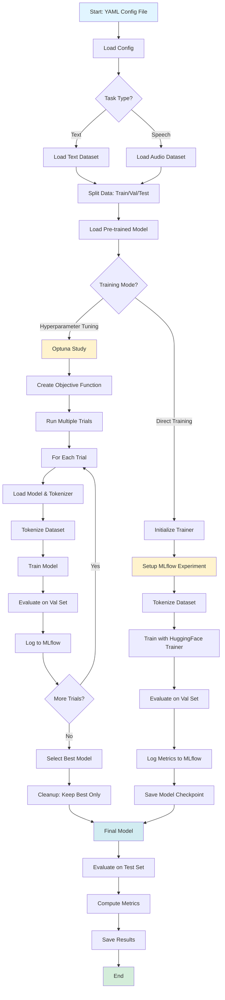

# 🇨🇭 Swiss Language Processing (SwissLP)

A minimal, best-practice repository for Text and Speech Processing using Swiss German and German language models.

## 📚 Course: Essentials in Text and Speech Processing

This project provides a clean, reproducible development environment using Nix flakes for cross-platform compatibility.

## 📊 Dataset

This project uses the **SwissDial** dataset for Swiss German dialect classification tasks.

## 🚀 Features

### Text Models
- **SwissBERT**: BERT model fine-tuned on Swiss German data
- **German BERT**: Standard BERT model for German language
- **XLM-RoBERTa**: Cross-lingual model supporting 100+ languages
- **ByT5**: Byte-level T5 model for multilingual tasks

### Speech Models
- **Wav2Vec2**: Facebook's self-supervised speech representation
- **AST**: Audio Spectrogram Transformer
- **Whisper**: OpenAI's robust speech recognition model

### Hardware Support
- **NVIDIA GPUs**: Automatic CUDA support
- **AMD GPUs**: Automatic ROCm support
- **Apple Silicon**: MPS acceleration on macOS
- **CPU**: Fallback for all systems

## 🛠️ Installation

### Option 1: Nix (Recommended - Reproducible)

The Nix approach provides the most reproducible environment across all platforms.

#### Prerequisites: Install Nix

**Linux (including WSL2):**
```bash
# Install Nix
curl --proto '=https' --tlsv1.2 -sSf -L https://install.determinate.systems/nix | sh -s -- --no-confirm

# Enable flakes (add to ~/.config/nix/nix.conf)
mkdir -p ~/.config/nix
echo "experimental-features = nix-command flakes" >> ~/.config/nix/nix.conf

# Restart your shell or run:
source /nix/var/nix/profiles/default/etc/profile.d/nix-daemon.sh
```

**macOS:**
```bash
# Install Nix
curl --proto '=https' --tlsv1.2 -sSf -L https://install.determinate.systems/nix | sh -s -- --no-confirm

# Enable flakes (add to ~/.config/nix/nix.conf)
mkdir -p ~/.config/nix
echo "experimental-features = nix-command flakes" >> ~/.config/nix/nix.conf

# Restart your shell or run:
source /nix/var/nix/profiles/default/etc/profile.d/nix-daemon.sh
```

**Windows (WSL2):**
```bash
# In WSL2, follow the Linux instructions above
# Make sure WSL2 is updated: wsl --update
```

#### Quick Start with Nix

1. **Clone the repository:**
   ```bash
   git clone https://github.com/btwbrauer/SwissLP.git
   cd SwissLP
   ```

2. **Enter the development environment:**
   ```bash
   nix develop
   ```

   The flake automatically detects your hardware and installs the appropriate PyTorch version.

3. **Verify installation:**
   ```bash
   python -c "import torch; print(f'PyTorch: {torch.__version__}')"
   pytest tests/ -v
   ```

#### Hardware-Specific Environments

```bash
# For NVIDIA CUDA
nix develop .#cuda

# For AMD ROCm
nix develop .#rocm

# For CPU-only (default)
nix develop .#default
```

### Option 2: Docker (Alternative)

If you prefer Docker or cannot install Nix:

```bash
# Build the Docker image (creates a result symlink)
nix build
docker load < result

# Run the container
docker run -it --gpus all swisslp:latest
```

**Note**: The `result` symlink is a Nix build artifact and can be safely deleted after loading into Docker.

### Option 3: Python Virtual Environment (Fallback)

**Note:** This method may have version conflicts and is less reproducible.

1. **Create virtual environment:**
   ```bash
   python -m venv venv
   source venv/bin/activate  # On Windows: venv\Scripts\activate
   ```

2. **Install dependencies:**
   ```bash
   pip install -e .
   ```

3. **Verify installation:**
   ```bash
   python -c "import torch; print(f'PyTorch: {torch.__version__}')"
   pytest tests/ -v
   ```

## 📁 Project Structure

```
SwissLP/
├── flake.nix              # Nix flake for reproducible environment
├── pyproject.toml         # Python dependencies and project configuration
├── README.md             # This file
├── src/
│   ├── models/           # Model loaders
│   │   ├── __init__.py
│   │   ├── text_models.py    # Text model loaders (SwissBERT, German BERT, XLM-R, ByT5)
│   │   └── speech_models.py  # Speech model loaders (Wav2Vec2, AST, Whisper)
│   ├── evaluation/       # Evaluation utilities
│   │   ├── __init__.py
│   │   ├── evaluator.py     # Evaluator classes
│   │   └── metrics.py       # Metrics computation
│   ├── config/          # Configuration management
│   │   ├── __init__.py
│   │   └── config.py        # Config classes and YAML loading
│   └── utils/          # Utility functions
│       ├── __init__.py
│       ├── data_loader.py    # Data loading utilities
│       └── prepare_dataset.py # Dataset preparation
├── scripts/            # Executable scripts
│   ├── train_text_model.py       # Text model training script
│   ├── train_speech_model.py     # Speech model training script
│   └── compare_models.py         # Model comparison script (inference-only)
├── configs/            # Configuration files
│   ├── swissbert.yaml  # SwissBERT configuration example
│   └── wav2vec2.yaml   # Wav2Vec2 configuration example
├── tests/             # Test suite
│   ├── __init__.py
│   ├── test_text_models.py
│   ├── test_speech_models.py
│   ├── test_data_loader.py
│   ├── test_training.py
│   └── test_config.py
└── notebooks/          # Jupyter notebooks (kept for reference)
```

## 🔄 Pipeline Workflow

The SwissLP pipeline follows a structured workflow from configuration to model evaluation:



### Workflow Steps

1. **Configuration Loading** (`src/config/config.py`)
   - Load YAML configuration file
   - Parse model, data, and training parameters
   - Create `Config` object with dataclasses

2. **Dataset Preparation** (`src/utils/dataset.py`)
   - Load SwissDial dataset from JSON
   - Filter by selected dialects
   - Split into train/validation/test sets
   - For text: tokenize and prepare sequences
   - For speech: load audio files and extract features

3. **Model Loading** (`src/models/text_models.py`, `src/models/speech_models.py`)
   - Load pre-trained models from Hugging Face
   - Initialize tokenizers/processors
   - Configure for classification task (num_labels)
   - Move to appropriate device (CPU/GPU/MPS)

4. **Training** (`src/training/trainer.py`)
   - Initialize `TextTrainer` or `SpeechTrainer`
   - Setup MLflow experiment tracking
   - Configure HuggingFace `Trainer` with:
     - Training arguments (learning rate, batch size, etc.)
     - Data collators (dynamic padding)
     - Early stopping callbacks
     - Metrics computation
   - Train model with progress bars (tqdm)
   - Save checkpoints and best model

5. **Hyperparameter Tuning** (`src/training/hyperparameter_tuning.py`)
   - Create Optuna study to maximize validation F1
   - Define search space (learning rate, batch size, etc.)
   - Run multiple trials:
     - Sample hyperparameters
     - Train model with sampled params
     - Evaluate on validation set
     - Log to MLflow
   - Select best trial based on validation F1

6. **Model Optimization** (`src/training/optimization.py`, `src/training/model_cleanup.py`)
   - Find best model from MLflow or Optuna
   - Rename best model directory
   - Delete other trial models to save space

7. **Evaluation** (`src/evaluation/evaluator.py`)
   - Load trained model
   - Evaluate on test dataset
   - Compute metrics (accuracy, precision, recall, F1)
   - Save results to JSON/CSV

8. **MLflow Tracking** (`src/utils/mlflow_utils.py`)
   - Setup tracking URI (default: http://localhost:5000)
   - Create/ensure experiment exists
   - Log parameters, metrics, and artifacts
   - Track all training runs for comparison

## 🔧 Usage

### Text Models

#### SwissBERT (Swiss German BERT)
```python
from src.models import load_swissbert

# Load pre-trained SwissBERT
model, tokenizer = load_swissbert()

# Load for classification with custom number of labels
model, tokenizer = load_swissbert(num_labels=4)

# Text preprocessing and inference
text = "Grüezi, wie gaht's dir hüt?"
inputs = tokenizer(text, return_tensors="pt", padding=True, truncation=True)
with torch.no_grad():
    outputs = model(**inputs)
    predictions = torch.nn.functional.softmax(outputs.logits, dim=-1)
```

#### German BERT
```python
from src.models import load_german_bert

# Load German BERT
model, tokenizer = load_german_bert()

# Load for classification
model, tokenizer = load_german_bert(num_labels=3)

# Inference
text = "Hallo, wie geht es dir heute?"
inputs = tokenizer(text, return_tensors="pt")
outputs = model(**inputs)
```

#### XLM-RoBERTa (Multilingual)
```python
from src.models import load_xlm_roberta

# Load XLM-RoBERTa
model, tokenizer = load_xlm_roberta()

# Load for classification
model, tokenizer = load_xlm_roberta(num_labels=5)

# Multilingual inference
texts = [
    "Grüezi, wie gaht's?",  # Swiss German
    "Hallo, wie geht's?",   # German
    "Hello, how are you?"   # English
]
inputs = tokenizer(texts, return_tensors="pt", padding=True, truncation=True)
outputs = model(**inputs)
```

#### ByT5 (Byte-level T5)
```python
from src.models import load_byt5

# Load ByT5
model, tokenizer = load_byt5()

# Load specific variant
model, tokenizer = load_byt5(model_name="google/byt5-small")

# Text generation/translation
text = "Grüezi, wie gaht's?"
inputs = tokenizer(text, return_tensors="pt")
outputs = model.generate(**inputs, max_length=50)
result = tokenizer.decode(outputs[0], skip_special_tokens=True)
```

### Speech Models

#### Wav2Vec2 (Speech Classification)
```python
from src.models import load_wav2vec2
import torchaudio

# Load Wav2Vec2
model, feature_extractor = load_wav2vec2()

# Load for classification
model, feature_extractor = load_wav2vec2(num_labels=4)

# Audio preprocessing and inference
audio_path = "audio.wav"
waveform, sample_rate = torchaudio.load(audio_path)

# Resample to 16kHz if needed
if sample_rate != 16000:
    resampler = torchaudio.transforms.Resample(sample_rate, 16000)
    waveform = resampler(waveform)

# Extract features
inputs = feature_extractor(waveform.squeeze().numpy(), sampling_rate=16000, return_tensors="pt")
with torch.no_grad():
    outputs = model(**inputs)
    predictions = torch.nn.functional.softmax(outputs.logits, dim=-1)
```

#### AST (Audio Spectrogram Transformer)
```python
from src.models import load_ast
import librosa

# Load AST
model, feature_extractor = load_ast()

# Load for classification
model, feature_extractor = load_ast(num_labels=3)

# Audio preprocessing
audio_path = "audio.wav"
waveform, sample_rate = librosa.load(audio_path, sr=16000)

# Extract features
inputs = feature_extractor(waveform, sampling_rate=16000, return_tensors="pt")
with torch.no_grad():
    outputs = model(**inputs)
    predictions = torch.nn.functional.softmax(outputs.logits, dim=-1)
```

#### Whisper (Speech Recognition)
```python
from src.models import load_whisper
import torchaudio

# Load Whisper
model, processor = load_whisper()

# Load specific variant
model, processor = load_whisper(model_name="openai/whisper-base")

# Audio preprocessing and transcription
audio_path = "audio.wav"
waveform, sample_rate = torchaudio.load(audio_path)

# Process audio
inputs = processor(waveform.squeeze().numpy(), sampling_rate=sample_rate, return_tensors="pt")
with torch.no_grad():
    outputs = model.generate(**inputs)
    transcription = processor.decode(outputs[0], skip_special_tokens=True)
```

### Data Loading and Preprocessing

#### Audio Data
```python
from src.utils import load_audio_file, preprocess_audio

# Load audio file
waveform, sample_rate = load_audio_file("audio.wav")

# Preprocess audio (resample, normalize)
processed_audio = preprocess_audio(waveform, sample_rate, target_sr=16000)

# Create audio dataset
audio_files = ["audio1.wav", "audio2.wav", "audio3.wav"]
labels = [0, 1, 0]
dataloader = create_audio_dataloader(audio_files, labels, batch_size=8)
```

#### Text Data
```python
from src.utils import create_text_dataloader, preprocess_text, split_dataset

# Text preprocessing
text = "Grüezi, wie gaht's dir hüt?"
cleaned_text = preprocess_text(text, lowercase=True, remove_punctuation=True)

# Create text dataset
texts = ["Text 1", "Text 2", "Text 3"]
labels = [0, 1, 0]
dataloader = create_text_dataloader(texts, labels, batch_size=16)

# Split dataset
train_data, val_data, test_data = split_dataset(
    data=texts,
    labels=labels,
    train_ratio=0.7,
    val_ratio=0.15,
    test_ratio=0.15
)
```

### Load All Models

```python
from src.models import load_all_text_models, load_all_speech_models

# Load all text models
text_models = load_all_text_models()
# Returns: {'swissbert': {'model': ..., 'tokenizer': ...}, 'german_bert': ..., ...}

# Load all speech models
speech_models = load_all_speech_models()
# Returns: {'wav2vec2': {'model': ..., 'processor': ...}, 'ast': ..., ...}

# Use specific models
swissbert_model = text_models['swissbert']['model']
wav2vec2_model = speech_models['wav2vec2']['model']
```

### Device Management

```python
from src.models import get_device
import torch

# Get optimal device
device = get_device()
print(f"Using device: {device}")

# Move models to device
model = model.to(device)

# Move data to device
inputs = {k: v.to(device) for k, v in inputs.items()}
```

## 🧪 Testing

Run all tests:
```bash
pytest tests/ -v
```

Run specific test file:
```bash
pytest tests/test_text_models.py -v
pytest tests/test_speech_models.py -v
pytest tests/test_data_loader.py -v
pytest tests/test_evaluation.py -v
pytest tests/test_config.py -v
```

Run with coverage:
```bash
pytest tests/ --cov=src --cov-report=html
```

## 🎓 Training Models

Fine-tune models on the Swiss German dialect dataset before evaluation:

### Text Models

```bash
# Train SwissBERT
python scripts/train_text_model.py --config configs/swissbert.yaml

# Train German BERT
python scripts/train_text_model.py --model german_bert

# Train XLM-RoBERTa
python scripts/train_text_model.py --model xlm_roberta

# Train all text models sequentially
python scripts/train_text_model.py --all
```

### Speech Models

```bash
# Train Wav2Vec2
python scripts/train_speech_model.py --config configs/wav2vec2.yaml

# Train AST
python scripts/train_speech_model.py --model ast

# Train all speech models sequentially
python scripts/train_speech_model.py --all
```

The training scripts will:
- Load the dataset and create train/val/test splits
- Fine-tune the model using Hugging Face Trainer with best practices:
  - **Dynamic padding** for efficient training (DataCollator)
  - **Early stopping** to prevent overfitting (configurable)
  - **Learning rate scheduling** (linear decay by default)
  - **Automatic checkpointing** and best model saving
- Save the fine-tuned model to `outputs/<experiment_name>/`
- Evaluate on the validation set during training
- **Automatically log experiments to MLflow** for tracking and comparison

## 🔬 Comparing Models

Compare models using either pre-trained (baseline) or fine-tuned models:

```bash
# Compare all models (text and speech)
python scripts/compare_models.py --data-path ./data/sentences_ch_de_transcribed.json

# Compare only text models
python scripts/compare_models.py --task-type text --data-path ./data/sentences_ch_de_transcribed.json

# Compare only speech models
python scripts/compare_models.py --task-type speech --data-path ./data/sentences_ch_de_transcribed.json

# Specify dialects
python scripts/compare_models.py \
    --data-path ./data/sentences_ch_de_transcribed.json \
    --dialects ch_de ch_lu ch_be ch_zh

# Custom output directory
python scripts/compare_models.py \
    --data-path ./data/sentences_ch_de_transcribed.json \
    --output-dir ./results/comparison_2024
```

The script will:
- Load all available text and speech models (pre-trained or fine-tuned)
- Evaluate each model on the test dataset
- Compare performance metrics (accuracy, precision, recall, F1-score)
- Save results to CSV and JSON files

### Evaluate Fine-Tuned Models

After training, evaluate your fine-tuned models:

```bash
# Evaluate fine-tuned models from outputs directory
python scripts/compare_models.py --use-trained-models --outputs-dir ./outputs

# Compare fine-tuned text models only
python scripts/compare_models.py --use-trained-models --models text
```

**Output files:**
- `text_model_comparison.csv`: Text model results

## 🔬 Hyperparameter Tuning

Automated hyperparameter optimization using Optuna with MLflow integration.

### Quick Start

```bash
# Tune SwissBERT with 20 trials
python scripts/tune_hyperparameters.py --model swissbert --n-trials 20

# Tune German BERT with 30 trials
python scripts/tune_hyperparameters.py --model german_bert --n-trials 30

# Tune with timeout (e.g., 2 hours)
python scripts/tune_hyperparameters.py --model xlm_roberta --n-trials 50 --timeout 7200
```

### Best Practices for Number of Trials

**Recommended trial counts:**
- **Initial exploration**: 10-20 trials
  - Quick overview of hyperparameter space
  - Identify promising regions
- **Medium optimization**: 20-50 trials
  - Good balance between time and quality
  - Suitable for most projects
- **Final optimization**: 50-100+ trials
  - Thorough search for production models
  - Best for important experiments

**Rule of thumb**: Use **10x the number of hyperparameters** being tuned.
- 5 hyperparameters → ~50 trials
- 3 hyperparameters → ~30 trials

**Dataset size considerations:**
- Small datasets (<10k samples): 10-20 trials
- Medium datasets (10k-100k): 20-50 trials
- Large datasets (>100k): 50-100+ trials

### How It Works

The tuning script automatically:
- **Optimizes key hyperparameters**: Learning rate, batch size, warmup steps, weight decay, LR scheduler
- **Uses Optuna's Tree-structured Parzen Estimator (TPE)** for efficient search
- **Logs all trials to MLflow** for comparison and analysis
  - All trials for a model go into the **same MLflow experiment** (named after the real model, e.g., "SwissBERT", "German BERT")
  - Individual runs are named "Trial 0", "Trial 1", etc. for easy identification
  - This allows you to **visually compare all trials** by overlaying graphs in the MLflow UI
- **Maximizes validation F1 score** as the objective
- **Handles cleanup** between trials to prevent memory issues

### Tuned Hyperparameters

The script optimizes:
- `learning_rate`: 1e-5 to 5e-5 (log scale)
- `batch_size`: 8, 16, or 32
- `warmup_steps`: 100 to 500
- `weight_decay`: 0.001 to 0.1 (log scale)
- `lr_scheduler_type`: "linear" or "cosine"
- `gradient_accumulation_steps`: 1 or 2 (when batch_size=8)

### Finding Best Parameters

After tuning, find the best hyperparameters:

```bash
# Find best parameters from tuning experiment (use real model name)
python scripts/find_best_params.py --experiment SwissBERT

# Show top 10 runs
python scripts/find_best_params.py --experiment German\ BERT --top-n 10

# Use different metric (e.g., accuracy)
python scripts/find_best_params.py --experiment XLM-RoBERTa --metric eval_accuracy
```

**Note**: Experiments are named after the real model names:
- `SwissBERT` (not `swissbert_hyperparameter_tuning`)
- `German BERT` (not `german_bert_hyperparameter_tuning`)
- `XLM-RoBERTa` (not `xlm_roberta_hyperparameter_tuning`)
- `Wav2Vec2`, `AST`, `ByT5`, `fastText`, `Whisper`

### Manual Hyperparameter Sweeps

You can also perform manual sweeps - MLflow will automatically track all runs:

```bash
# Train with different learning rates
for lr in 1e-5 2e-5 3e-5 5e-5; do
  # Modify config and train
  python scripts/train_text_model.py --config configs/swissbert.yaml
done

# Then find best:
python scripts/find_best_params.py --experiment swissbert_baseline
```

## 📊 MLflow Experiment Tracking

All training runs are automatically logged to MLflow for experiment tracking and comparison.

### MLflow Tracking Configuration

By default, the training scripts log to **http://localhost:5000** (remote MLflow server).

**To use a different MLflow server**, set the `MLFLOW_TRACKING_URI` environment variable:

```bash
# Use remote server (default: http://localhost:5000)
export MLFLOW_TRACKING_URI="http://localhost:5000"

# Or use local file-based tracking
export MLFLOW_TRACKING_URI="./mlruns"

# Or use a different remote server
export MLFLOW_TRACKING_URI="http://your-server:5000"
```

**Note**: If you're running MLflow in a Podman/Docker container on localhost:5000, no configuration is needed - it will automatically connect to it.

### What Gets Logged

MLflow automatically tracks:
- **Parameters**: Model configuration, hyperparameters, data splits
- **Metrics**: Training loss, validation metrics (accuracy, F1, etc.), per-class metrics
- **Artifacts**: Trained models, checkpoints, config files
- **Experiment metadata**: Run name, timestamp, experiment name

### MLflow Architecture

**Important**: MLflow consists of two parts:

1. **Python Package** (`mlflow`): The client library that logs experiments (already installed)
2. **MLflow Server/UI**: A web server that displays the logged experiments (must be started separately)

**How it works:**
- When you run training, the Python code logs to the MLflow tracking server (default: `http://localhost:5000`)
- The MLflow UI server reads from the backend store and displays it in a web interface
- The server can run **locally** (file-based: `./mlruns/`) or **remotely** (e.g., Podman container on `localhost:5000`)
- All experiments are stored in the backend store and persist independently of the UI server

**Default Configuration:**
- Training scripts log to: `http://localhost:5000` (remote server)
- You can override this with `MLFLOW_TRACKING_URI` environment variable
- `speech_model_comparison.csv`: Speech model results  
- `all_comparisons.json`: Combined results in JSON format

## ⚙️ Configuration

Model comparison can be configured using YAML files in the `configs/` directory.

Key configuration sections:
- **model**: Model name, number of labels, device
- **data**: Data path, dialects, train/val/test splits, batch_size
- **experiment_name**: Name for organizing outputs
- **task_type**: "text", "speech", or "both"

**Note**: Training configuration is now integrated with best practices:
- **Dynamic padding** via DataCollator for efficient training
- **Early stopping** to prevent overfitting (configurable in YAML)
- **Learning rate scheduling** (linear decay by default, configurable)
- Use `scripts/train_text_model.py` and `scripts/train_speech_model.py` to fine-tune models before evaluation.

## 🔬 Development

### Code Quality

The project includes:
- **Black**: Code formatting
- **Flake8**: Linting
- **MyPy**: Type checking
- **Pytest**: Testing framework

Format code:
```bash
black src/ tests/
```

Lint code:
```bash
flake8 src/ tests/
```

Type check:
```bash
mypy src/
```

### Jupyter Notebooks

Start Jupyter:
```bash
jupyter notebook
```

Or use Jupyter Lab:
```bash
jupyter lab
```

## 📦 Dependencies

### Exact Versions (from flake.nix)

| Package | Version | Purpose |
|---------|---------|---------|
| torch | 2.7.0 | Deep learning framework |
| torchaudio | 2.7.0a0 | Audio processing |
| torchvision | 0.22.0 | Computer vision |
| transformers | 4.51.3 | Hugging Face models |
| datasets | 3.5.1 | Dataset utilities |
| tokenizers | 0.21.1 | Text tokenization |
| accelerate | 1.5.2 | Training acceleration |
| nltk | 3.9.1 | Natural language toolkit |
| sentencepiece | 0.2.0 | Text tokenization |
| librosa | 0.11.0 | Audio analysis |
| soundfile | 0.13.1 | Audio I/O |
| numpy | 2.2.5 | Numerical computing |
| pandas | 2.2.3 | Data manipulation |
| scikit-learn | 1.6.1 | Machine learning |
| jupyter | 1.1.1 | Notebook environment |
| pytest | 8.3.5 | Testing framework |
| pytest-cov | 6.1.0 | Coverage reporting |
| tqdm | 4.67.1 | Progress bars |
| pyyaml | 6.0.2 | YAML parsing |

See `pyproject.toml` for the complete list of dependencies. For exact versions matching the Nix environment, check `flake.nix`.

## 🌍 Hardware Optimization

The Nix flake automatically selects the optimal PyTorch build:

| Platform | Hardware | PyTorch Build | Command |
|----------|----------|---------------|---------|
| Linux | NVIDIA GPU | torchWithCuda | `nix develop .#cuda` |
| Linux | AMD GPU | torchWithRocm | `nix develop .#rocm` |
| macOS | Apple Silicon | torch (with MPS) | `nix develop` |
| macOS | Intel | torch (CPU) | `nix develop` |
| Other | Any | torch (CPU) | `nix develop` |

## 🤝 Contributing

1. Fork the repository
2. Create a feature branch
3. Make your changes
4. Run tests: `pytest tests/ -v`
5. Format code: `black src/ tests/`
6. Submit a pull request

## 🙏 Acknowledgments

- **Hugging Face**: For the transformers library and model hub
- **NixOS Community**: For the reproducible build system
- **PyTorch Team**: For the deep learning framework
- **Course Instructors**: For guidance and support

## 📚 Resources

- [Hugging Face Models](https://huggingface.co/models)
- [PyTorch Documentation](https://pytorch.org/docs/)
- [Nix Flakes](https://nixos.wiki/wiki/Flakes)
- [SwissBERT Paper](https://aclanthology.org/2023.swisstext-1.3/)